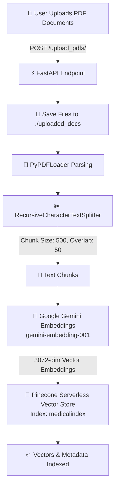
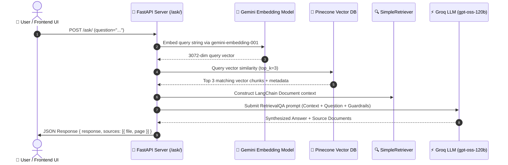

# 🏥 MediBot - RAG-Based Medical Assistant Chatbot

[](https://fastapi.tiangolo.com/)
[](https://www.langchain.com/)
[](https://www.pinecone.io/)
[](https://ai.google.dev/)
[](https://groq.com/)
[](LICENSE)

An intelligent, context-aware **Retrieval-Augmented Generation (RAG)** Medical Assistant designed to answer health and document-related queries using uploaded medical PDFs. Built with **FastAPI**, **LangChain**, **Pinecone Vector Database**, **Google Gemini Embeddings**, **Groq High-Speed LLM Inference**, and a modern **Glassmorphism Web UI**.

---

## 🌟 Key Features

- 📄 **Multi-Document PDF Processing**: Drag-and-drop or upload multiple medical PDF documents simultaneously.
- ⚡ **High-Performance Vector Indexing**: Real-time document chunking and vector storage powered by Pinecone Serverless.
- 🧠 **Context-Grounded Medical Q&A**: Answers generated exclusively from uploaded document context to prevent hallucinations.
- 📌 **Exact Source Attribution & Citations**: Every response lists precise source PDF filenames and page numbers for transparent verification.
- 🎨 **Modern Responsive UI**: Dual Light/Dark medical theme, smooth glassmorphism effects, live typing indicators, and mobile-friendly design.
- 🛡️ **Medical Safety Guardrails**: Built-in system prompt constraints enforcing factual accuracy and non-diagnostic disclaimers.

---

## 🔄 End-to-End System Pipeline Architecture

MediBot operates through a two-phase architecture: **Document Ingestion & Vector Indexing** and **Retrieval-Augmented Query Execution**.

### 1. Document Ingestion & Vector Indexing Pipeline



#### Detailed Ingestion Steps:
1. **File Upload & Storage**: The frontend submits PDF files to [`server/routes/upload_pdfs.py`](server/routes/upload_pdfs.py). Files are validated and stored in `uploaded_docs/`.
2. **Document Parsing**: `PyPDFLoader` ([`server/modules/load_vectorstore.py`](server/modules/load_vectorstore.py)) extracts raw text content along with page metadata.
3. **Text Chunking**: `RecursiveCharacterTextSplitter` divides documents into contiguous 500-character chunks with a 50-character overlap to retain contextual continuity across boundaries.
4. **Vector Embedding**: Each chunk is transformed into a dense 3072-dimensional vector embedding using Google Generative AI's `models/gemini-embedding-001`.
5. **Metadata Enrichment & Vector Upsert**: Full text, source filename, and 0-indexed page number metadata are packaged with vector embeddings and upserted to Pinecone's serverless index (`medicalindex`, AWS `us-east-1`, `dotproduct` distance metric).

---

### 2. RAG Query & Inference Pipeline



#### Detailed Query Steps:
1. **Query Submission**: User inputs a medical question via the frontend chat interface, sending a form payload to [`server/routes/ask_question.py`](server/routes/ask_question.py).
2. **Query Vectorization**: Google Gemini Embeddings converts the incoming text question into a 3072-dimensional vector.
3. **Similarity Search**: Pinecone performs a k-Nearest Neighbors vector search to locate the top 3 most relevant document chunks based on dot-product similarity score.
4. **Context Retrieval**: Retrieved text chunks and metadata are mapped into a custom `SimpleRetriever` LangChain `Document` list.
5. **Prompt Injection & LLM Inference**: LangChain `RetrievalQA` chain constructs a system prompt injecting the retrieved context, user question, and strict guardrails into Groq's high-speed LLM engine (`openai/gpt-oss-120b` via [`server/modules/llm.py`](server/modules/llm.py)).
6. **Citation Extraction & Formatting**: The response handler extracts source file names and adjusts 0-indexed pages to human-readable 1-indexed page numbers ([`server/modules/query_handlers.py`](server/modules/query_handlers.py)), returning structured JSON to the UI.

---

## 🛠️ Technology Stack & System Components

| Layer | Technology | Purpose |
| :--- | :--- | :--- |
| **Frontend** | HTML5, CSS3, Vanilla JS | Modern glassmorphism web interface with dark/light themes |
| **Backend API** | FastAPI, Uvicorn | High-performance asynchronous REST API framework |
| **Orchestration** | LangChain Core / Community | RAG pipeline, document loading, QA chain assembly |
| **Embedding Model** | Google Gemini (`models/gemini-embedding-001`) | 3072-dimensional document & query vector embeddings |
| **Vector Store** | Pinecone Serverless | Cloud-native vector search database (`medicalindex`) |
| **LLM Engine** | ChatGroq (`openai/gpt-oss-120b`) | Ultra-fast context synthesis and answer generation |
| **Document Parser** | PyPDF / PyPDFLoader | Structural extraction from uploaded PDF documents |
| **Environment** | Python 3.13+, `python-dotenv` | Dependency management & environment configuration |

---

## 📂 Project Directory Structure

```
Rag-based-Medical-Chatbot/
├── 📁 frontend/                     # Web Frontend UI
│   ├── 📄 index.html                # Main UI markup & structure
│   ├── 📄 styles.css                # CSS design system (glassmorphism, themes)
│   ├── 📄 app.js                    # UI interactions & API integration logic
│   ├── 📄 README.md                 # Frontend component details
│   └── 📄 DEPLOYMENT.md             # Production deployment instructions
├── 📁 server/                       # FastAPI Backend Application
│   ├── 📄 main.py                   # FastAPI entrypoint, middleware, CORS
│   ├── 📄 logger.py                 # Structured logging setup
│   ├── 📄 requirements.txt          # Server dependencies
│   ├── 📄 .env                      # API keys & index configuration
│   ├── 📁 middleware/               # Custom Exception Handling middleware
│   ├── 📁 modules/                  # Core RAG Modules
│   │   ├── 📄 load_vectorstore.py   # PDF loading, chunking & Pinecone upsert
│   │   ├── 📄 llm.py                # Groq Chat model & RetrievalQA chain
│   │   ├── 📄 pdf_handlers.py       # Temporary storage handlers
│   │   └── 📄 query_handlers.py     # Response & citation metadata formatter
│   └── 📁 routes/                   # API Routes
│       ├── 📄 ask_question.py       # Query processing route (/ask/)
│       └── 📄 upload_pdfs.py        # PDF upload route (/upload_pdfs/)
├── 📄 pyproject.toml                # Python project configuration
├── 📄 .gitignore                    # Git exclusions
└── 📄 README.md                     # Main Project Documentation
```

---

## 🔑 Environment Configuration

Create a `.env` file inside the [`server/`](server/) directory containing your API credentials:

```env
GOOGLE_API_KEY="your_google_gemini_api_key"
GROQ_API_KEY="your_groq_api_key"
PINECONE_API_KEY="your_pinecone_api_key"
PINECONE_INDEX_NAME="medicalindex"
```

---

## 🚀 Quick Start Guide

### Prerequisites
- Python 3.13 or higher installed
- Valid API keys for Google Gemini, Groq, and Pinecone

### 1. Set Up Environment & Install Dependencies

From the project root:

```bash
# Activate your python virtual environment
# Windows:
.venv\Scripts\activate

# Install server requirements
pip install -r server/requirements.txt
```

### 2. Start the Backend API Server

Run Uvicorn server from the project root:

```bash
uvicorn server.main:app --reload --port 8000
```
The FastAPI backend server will launch at `http://localhost:8000`. You can inspect interactive API documentation at `http://localhost:8000/docs`.

### 3. Launch the Frontend Interface

Serve the frontend files using Python's built-in HTTP server:

```bash
cd frontend
python -m http.server 3000
```
Open `http://localhost:3000` in your web browser to start using MediBot.

---

## 📡 API Endpoint Reference

### `POST /upload_pdfs/`
Upload one or multiple PDF documents to be processed into the Pinecone vector index.

- **Request Type**: `multipart/form-data`
- **Body**: `files`: List of PDF files
- **Response**:
```json
{
  "messages": "Files processed and vectorstore updated"
}
```

### `POST /ask/`
Submit a question to query the vector store and generate an answer with source citations.

- **Request Type**: `application/x-www-form-urlencoded`
- **Body**: `question`: String (e.g. `"What are the primary symptoms of hypertension?"`)
- **Response**:
```json
{
  "response": "According to the provided document, common symptoms of hypertension include...",
  "sources": [
    {
      "file": "medical_guide.pdf",
      "page": 14
    }
  ]
}
```

---

## 🛡️ Medical Safety & Guardrails

MediBot incorporates strict prompt engineering safety guardrails to ensure user safety:
- **Fact-Grounded**: Answers are derived strictly from retrieved document chunks.
- **Anti-Hallucination**: If relevant information is absent from uploaded documents, MediBot responds with: *"I'm sorry, but I couldn't find relevant information in the provided documents."*
- **Non-Diagnostic**: MediBot explicitly avoids providing medical diagnoses or prescribing treatments, maintaining an informative, factual tone.

---

## 📜 License

This project is licensed under the MIT License - see the LICENSE file for details.
